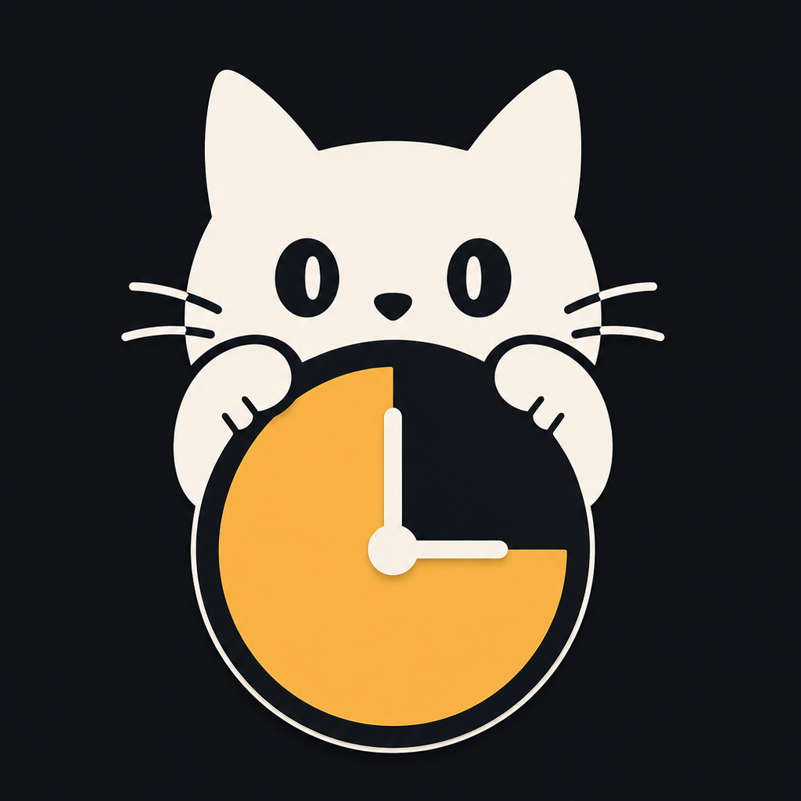
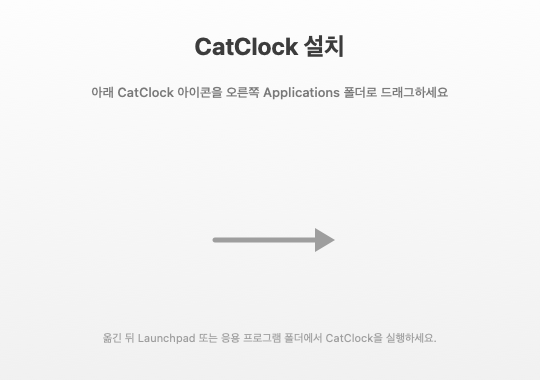

<div align="center">
  

  # CatClock

  맥용 고양이 플로팅 타이머 위젯 — 작업·퇴근까지 카운트다운, 곁눈질로 귀엽게 확인.

  [](https://github.com/Kim-Jiny/CatClock/releases/latest/download/CatClock.dmg)
  [](https://github.com/Kim-Jiny/CatClock/releases)
  
  
</div>

---

## 다운로드 & 설치

[**CatClock.dmg 받기**](https://github.com/Kim-Jiny/CatClock/releases/latest/download/CatClock.dmg) →
DMG 열기 → **CatClock.app 을 Applications 폴더로 드래그** → Launchpad/Finder에서 더블클릭.

> Developer ID 서명 + 공증(notarization) 완료 — 경고 없이 바로 실행됩니다.

### 설치 창



## 주요 기능

- **메뉴바 상주 + 투명 플로팅 위젯** — Dock 아이콘 없음
- **드래그로 이동·크기 조절**, 화면 안에 자동 고정, 위치/크기 기억
- **표시 모드**: 항상 최상단 ↔ 데스크탑에만
- **타이머 모드**
  - 집중용: 분 단위 (프리셋 5/15/25/45/60)
  - 출퇴근용: 퇴근 시각 입력 / 근무 N시간 카운트다운
- **고양이 스킨** — SF Symbols 기반 6종 (치즈/까만/턱시도/회색/삼색/흰둥이) + **내 사진** (투명 PNG 권장)
- **시간 자유 배치** — 사진 안에서 위치·크기 드래그로 자유 조절, 외곽선 글씨로 어떤 배경에서도 또렷
- **자동화** — 로그인 시 자동 실행 + 실행되면 자동으로 타이머 시작
- **종료 알림** — 위젯 자동 노출 + 빨강 깜빡임 + 끌 때까지 반복 비프
- **유저 설정 보존** — UserDefaults 기반, 재실행 시 모든 상태 복원

## 스크린샷

> 실제 위젯 스크린샷은 추후 추가 예정.
> 캡처 후 `Resources/screenshot-*.png` 로 떨궈주시면 여기 박힙니다.

<!--
<p align="center">
  
  
</p>
-->

## 요구 사항

- macOS **14 (Sonoma) 이상**
- Apple Silicon / Intel 둘 다 OK

## 개발

### 빌드·실행

```bash
swift run                  # 평소 개발/테스트
./build_app.sh             # ./CatClock.app 생성 (ad-hoc 서명, 본인 맥에서만)
./build_app.sh --install   # 위 + /Applications 에 설치
```

또는 Xcode에서 `Package.swift` 열고 ▶︎ 실행.

### 배포 (Developer ID 서명·공증·DMG)

준비 (1회):
1. Developer ID Application 인증서 (Xcode ▸ Settings ▸ Accounts ▸ Manage Certificates)
2. 공증 자격증명 등록:
   ```bash
   xcrun notarytool store-credentials CatClockNotary \
     --apple-id "<애플ID>" --team-id "<TEAMID>" --password "<앱암호>"
   ```

원클릭 릴리즈:
```bash
./release.sh 1.0.1                    # Info.plist 버전 갱신 → 커밋·푸시 → DMG 빌드 → 태그 → GitHub Release + DMG 첨부
./release.sh 1.0.1 --notes "버그 픽스: ..."
./release.sh 1.0.1 --draft            # Release 를 draft 로
```

빌드만 따로:
```bash
./release_dmg.sh           # 서명·공증·스테이플·DMG 생성
```

## 구조

| 파일 | 역할 |
|---|---|
| `Sources/CatClock/main.swift` | 진입점, .accessory 정책 |
| `Sources/CatClock/AppDelegate.swift` | 메뉴바·패널 구성, 액션 |
| `Sources/CatClock/FloatingPanel.swift` | 투명·드래그·레벨 전환 패널 (화면 안 고정 포함) |
| `Sources/CatClock/WidgetView.swift` | 위젯 UI (배율 적용된 네이티브 렌더링) |
| `Sources/CatClock/TimerEngine.swift` | 타이머 핵심 (목표 시각 기준, 작업/퇴근/근무시간) |
| `Sources/CatClock/SettingsView.swift` | 설정 화면 (모드·시간·고양이·자동실행) |
| `Sources/CatClock/CatView.swift` | 고양이+알람시계 SF Symbols 합성 |
| `Sources/CatClock/CatSkin.swift` / `SkinStore.swift` | 스킨 6종 + 선택 저장 |
| `Sources/CatClock/CustomCat.swift` | 사용자 사진 보관/로드 |
| `Sources/CatClock/OutlinedText.swift` | 배경 없는 테두리 글씨 |
| `Sources/CatClock/DragCatcher.swift` / `ResizeHandle.swift` | AppKit 드래그 처리(창 이동 차단) |
| `Sources/CatClock/LayoutStore.swift` | 위젯 배율·시간 위치/크기 저장 |
| `Sources/CatClock/LoginItem.swift` | 로그인 자동 실행 (LaunchAgent) |
| `Sources/CatClock/DisplayMode.swift` | 최상단/데스크탑 |
| `Sources/CatClock/Settings.swift` | UserDefaults 저장소 |
| `Resources/Info.plist` | 번들 메타 (버전·아이콘·LSUIElement) |
| `build_app.sh` | 개발용 .app 빌드 (ad-hoc) |
| `release_dmg.sh` | 정식 .app + DMG (Developer ID + 공증) |
| `release.sh` | 원클릭 릴리즈 (버전·커밋·빌드·태그·GitHub Release) |

> Swift 6.2 / SwiftPM 실행 타깃. Swift 6 strict concurrency 사용 — UI 타입은 `@MainActor` 격리.

## 기획

상세한 기획·로드맵은 [`기획.md`](기획.md) 참고.

## 라이선스

내부용. 별도 명시 전까지 사적 이용 가정.
